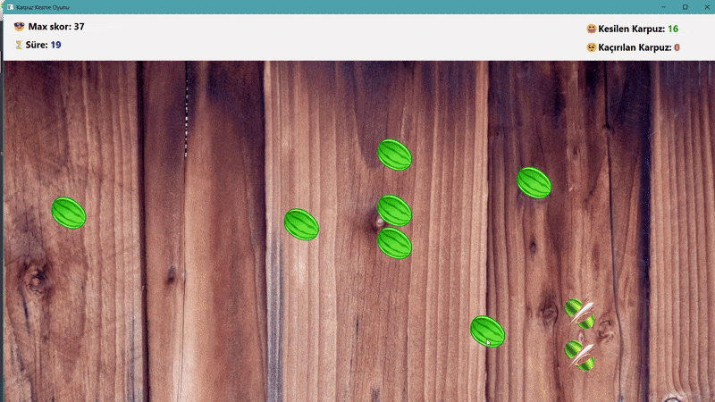

# 🎮 Karpuz Kesme Oyunu (Görsel Programlama Ödevi)

## 📌 Oyun Açıklaması
- **Ders:** 2024-2025 2.Sınıf Bahar Yarıyılı - Görsel Programlama
- Bu proje, *Fruit Ninja* oyunundan esinlenilerek oluşturulmuş bir **karpuz kesme oyunudur**. Amaç, 30 saniyelik süre içerisinde mümkün olduğunca çok karpuzu keserek yüksek skor elde etmektir.
- +2 bonus puan kazandım 😎

---

## 🚀 Özellikler

- ✅ Qt 5/6 ile GUI geliştirme
- ✅ `QMainWindow` tabanlı tam ekran arayüz
- ✅ `konumlar.txt` dosyasından konum okuma
- ✅ `QTimer` ile zamanlama ve süre takibi
- ✅ `QPixmap` ve `QLabel` ile karpuz görselleri
- ✅ Mouse ile tıklama ile kesme animasyonu
- ✅ Kesilen/kaçırılan karpuz sayısı ve kalan süre üst panelde
- ✅ `skorlar.txt` dosyasına skor kaydı
- ✅ Maksimum skor kontrolü ve kullanıcıya gösterimi
- ✅ Qt kaynak sistemi (`kaynaklarim.qrc`) üzerinden görsel yönetimi

---

## 🛠 Kurulum & Çalıştırma

1. **Qt Creator** ile `KarpuzKesmeOyunu.pro` dosyasını açın.
2. Gerekli kaynakların (resimler, `konumlar.txt`) proje dizininde olduğundan emin olun.
3. Projeyi derleyin ve çalıştırın.
4. Oyun başladığında 30 saniye süresince karpuzlara tıklayarak en yüksek skoru yapmaya çalışın.

---

## ⏳ Oyun Süreci

- Oyun başladığında 30 saniyelik sayaç devreye girer.
- `konumlar.txt`'den alınan konumlara göre karpuzlar belirir.
- Tıklanan karpuzlar kesilmiş karpuza dönüşür ve kısa süre sonra kaybolur.
- Her kaçırılan karpuz istatistiklere yansır.
- Süre bittiğinde oyun sona erer ve skor `skorlar.txt` dosyasına kaydedilir.

---
## 📽️ Oyun Videosu

Oyun içi deneyimi görmek için aşağıdaki videoyu izleyebilirsiniz:

🎥 **[Karpuz Kesme Oyunu Tanıtım Videosu (YouTube)](https://www.youtube.com/watch?v=IJ7QwbOhyuI)**

---

## 📝 Proje Hakkında Medium Yazısı

Bu proje hakkında yazdığım detaylı yazıya aşağıdaki bağlantıdan ulaşabilirsiniz:

👉 ([Medium yazısı](https://medium.com/@nazli_unay/qt-ve-c-ile-karpuz-kesme-oyunu-geli%C5%9Ftirdim-4907308bf75a))

---
## 👩‍💻 Geliştirici Bilgileri

- **Ad Soyad**: Şerife Nazlı Ünay  
- **Üniversite**: Necmettin Erbakan Üniversitesi  
- **Bölüm**: Bilgisayar Mühendisliği
- **LinkedIn**: [linkedin.com/in/serife-nazli-unay](https://www.linkedin.com/in/serife-nazli-unay/)  
- **Medium**: [medium.com/@nazli_unay](https://medium.com/@nazli_unay)

---

## ✉️ İletişim

Herhangi bir geri bildirim ya da geliştirme önerisi için iletişime geçebilirsiniz.  
📧 E-posta: [unay.nazli42@gmail.com]
